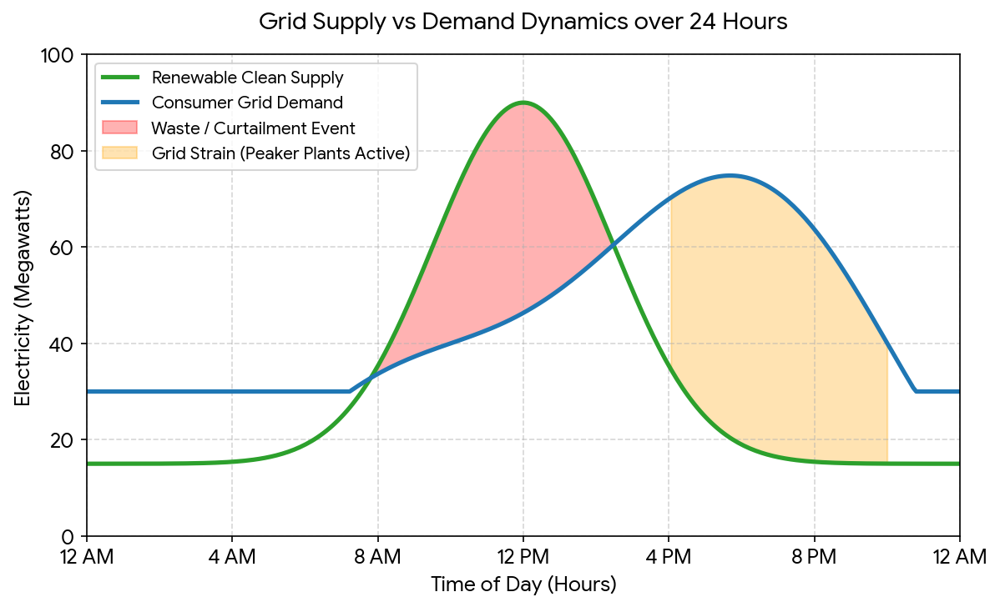

# Context

The electricity generated to feed the power grid can be considered "clean" or "dirty". Clean energy is when the eletricity is supplied from renewable resources: wind, solar, hydro, etc. Conversely it is dirty when supplied from non-renewable resources: coal, oil, gas, etc. In this context we consider non-renewable energy as "dirty" due to the greenhouse gas emissions (GHG) produced: carbon-dioxide, methane, etc. along with other associated environmental pollutants.

Cloud data centers, connected via the electrical grid, can consume energy from various sources, ranging from clean to dirty. As most renewable resources are intermittent in their availability (i.e. the sun doesn't always shine, its not always windy, etc.) the grid can vary in its cleanliness throughout the day. When renewables are less available the dirty non-renewables are available instead.

The demand for energy from the grid changes throughout the day also. During peak consumption periods the supply could be dirty or clean. The worst conditions we can observe is when peak demand periods overlap with peak dirty supply periods - the consequences are high GHG emissions. Conversely, the best conditions are when peak demand periods overlap with peak clean supply periods - lowest GHG emissions.

# Problem

### Dirty Compute Jobs
Large compute jobs consume a lot of energy within sustained windows of operation, which contributes to GHG emissions depending upon how dirty the grid is at the time. A batch process like an ETL, large database backup, log aggregation, machine learning training job, etc. could be running during peak demand / dirty supply period - contributing to GHG emissions.

Adding demand to peak periods increases the risk of grid operators having to spin up heavy "peaker plants" - contributing to to dirtier peaks. This also has a cost impact - the majority of dirty energy supply is more expensive than clean energy ([IRENA report](https://www.irena.org/-/media/Files/IRENA/Agency/Publication/2025/Jul/IRENA_TEC_RPGC_in_2024_Summary_2025.pdf)), especially due to peaker plants.

### Grid Bottlenecks
As demand for energy from the grid increases over the years (mostly due to AI data centers) the legacy parts of the grid can start to degrade or fail due to insufficent maintainance or development in face of rapid increase of demand. Peak periods can cause serious issues for the grid operators and the underlying infrastructure.

### Wasted Clean Energy
Clean energy supply can surpass consumer demand. Because the grid needs to maintain a stable equalibrium between supply and demand - clean energy production is curtailed (throttled down or turned off) in order to match the lower consumer demand. This is "free clean energy" if there were a consumer available to match the hightened supply.

- How do we reduce our GHG footprint?
- How do we reduce our consumption of dirty energy during our daily compute operations?
- How can we better consume clean energy?
- How can we avoid peak consumption periods which put strain on the grid?
- How can we consume the surplus "free clean energy"?

The Energy Dashboard provides a view of the grid's [supply/demand](https://www.energydashboard.co.uk/live) and where supply is operating on [the map](https://www.energydashboard.co.uk/map).

# Solution

It is possible to reduce the GHG footprint of compute workloads by shifting **when** and **where** they operate and **how much** resource they consume when running. It allows workloads to shift and adapt their demand to match cleaner supply. This provides us with a 3-dimensional solution space, so therefore 3-degrees of freedom. Each link to a cross-domain pattern:

1. **Temporal Supply** - run workloads when the grid is optimal for clean energy consumption - LINK
2. **Spatial Supply** - run workloads in data center regions where there is optimal clean energy available geographically. - LINK
3. **Resource Demand** - run workloads but at various resource consumption rates depending upon clean energy availability in realtime and in location. LINK

DIAGRAM

# Links

- [Carbon-aware Computing Whitepaper](https://pub-c2c1d9230f0b4abb9b0d2d95e06fd4ef.r2.dev/sites/418/2023/01/carbon_aware_computing_whitepaper.pdf)
- https://arxiv.org/html/2603.10768v1
- [On the Limitations of Carbon-Aware Temporal and Spatial Workload Shifting in the Cloud](https://arxiv.org/abs/2306.06502)
- [Carbon-Aware Spatio-Temporal Workload Shifting in Edge–Cloud Environments: A Review and Novel Algorithm](https://www.mdpi.com/2071-1050/17/14/6433)
- [A Survey on Task Scheduling in Carbon-Aware Container Orchestration](https://arxiv.org/html/2508.05949v1)

# Notes

- Can Demand Shaping work with eventual consistency? i.e. when clean energy is more available then more compute is available to process jobs in a queue. The cleaner the faster.